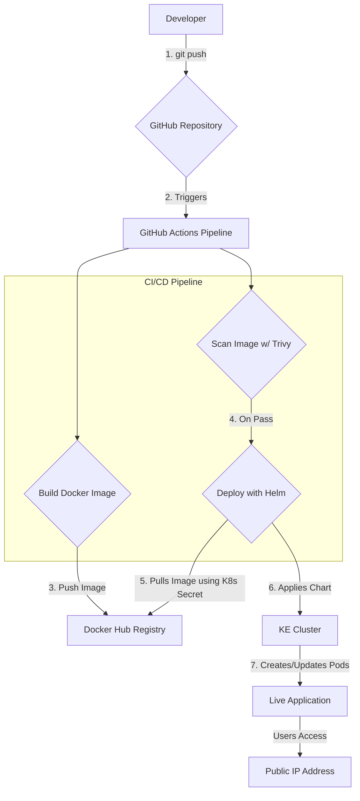

# Automated Kubernetes Deployment Project

## Overview

[cite_start]This repository contains a fully automated CI/CD pipeline for deploying a simple "Hello, World" Node.js web application to a managed Kubernetes cluster on Google Cloud Platform (GCP). [cite: 3] [cite_start]The entire infrastructure is managed as code using Terraform, and deployments are handled automatically by GitHub Actions upon every push to the `main` branch. [cite: 7, 10, 18]

---

## Features

* [cite_start]**Infrastructure as Code (IaC):** A Google Kubernetes Engine (GKE) cluster is provisioned entirely with Terraform. [cite: 10]

* [cite_start]**Containerization:** The application is packaged into an optimized, multi-stage Docker image for size and efficiency. [cite: 12, 13]

* [cite_start]**CI/CD Automation:** A GitHub Actions pipeline automates the build, push, security scan, and deployment process. [cite: 16]

* [cite_start]**Helm for Packaging:** Kubernetes manifests are packaged as a Helm chart for templated, repeatable deployments. [cite: 29]

* [cite_start]**Security Scanning:** The Docker image is scanned for `HIGH` and `CRITICAL` vulnerabilities using Trivy before deployment. [cite: 32]

* [cite_start]**Secrets Management:** Docker Hub credentials are securely stored within the Kubernetes cluster and used for pulling the image. [cite: 30]

---

## Workflow Diagram

The pipeline follows a modern GitOps workflow:




---


## Instructions to Run


### Prerequisites


* Google Cloud SDK (`gcloud`)

* Terraform

* Helm

* A configured GCP account with billing enabled.


### Steps


1.  [cite_start]**Provision the Infrastructure:** [cite: 24]

    Navigate to the `terraform` directory and apply the configuration. This will create the GKE cluster.


    ```bash

    cd terraform

    terraform apply

    ```


2.  [cite_start]**Create the Kubernetes Secret:** [cite: 24]

    Create the Docker Hub secret in the cluster. **(Note: This is a one-time manual step)**.


    ```bash

    kubectl create secret docker-registry docker-creds \

      --docker-server=[https://index.docker.io/v1/](https://index.docker.io/v1/) \

      --docker-username=<your-dockerhub-username> \

      --docker-password=<your-dockerhub-password> \

      --docker-email=<your-email>

    ```


3.  [cite_start]**Automated Deployment:** [cite: 24]

    The GitHub Actions pipeline is configured to run automatically on every push to the `main` branch. [cite_start]It will build, scan, and deploy the application without any manual intervention. [cite: 18, 19, 20, 21]


---

## Design Choices

* [cite_start]**GKE:** I chose Google Kubernetes Engine for its simplicity and managed control plane, which reduces operational overhead. [cite: 10]

* [cite_start]**Terraform:** Using Terraform for Infrastructure as Code ensures the environment is reproducible, version-controlled, and prevents configuration drift. [cite: 10]

* [cite_start]**Multi-stage Dockerfile:** This approach creates a final production image that is small and secure by excluding build-time dependencies, fulfilling the optimization requirement. [cite: 13]

* **Helm:** I used Helm to package the Kubernetes manifests. [cite_start]This allows for templating and managing application releases in a clean, versionable way, which is far superior to using static YAML files or simple find-and-replace commands in a pipeline. [cite: 29]

* **Trivy:** Integrating a vulnerability scanner directly into the pipeline creates an automated security gate that prevents insecure code from reaching production. [cite_start]This aligns with modern "Shift-Left" security principles. [cite: 32]

---
