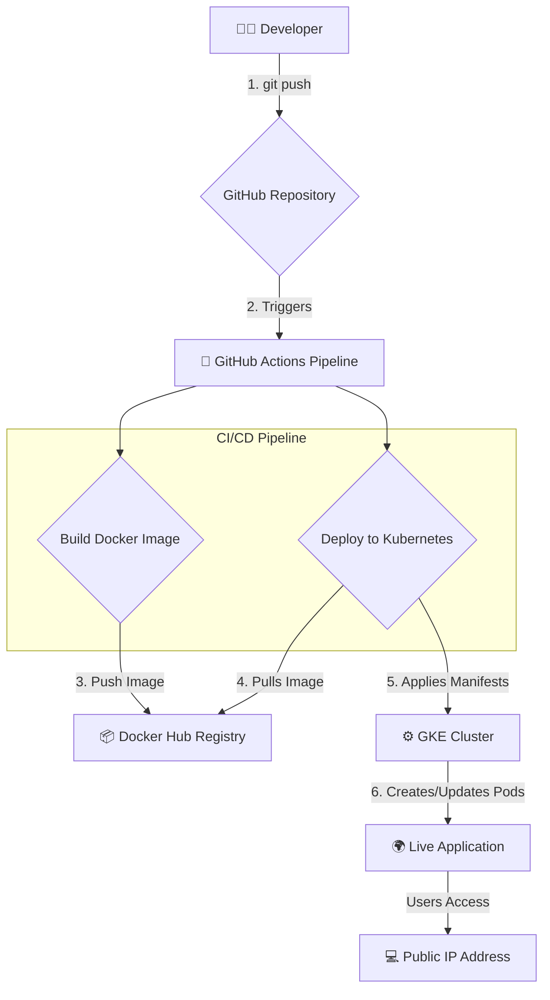

```mermaid
graph TD
    A[👨‍💻 Developer] -- 1. git push --> B{GitHub Repository};
    B -- 2. Triggers --> C[🚀 GitHub Actions Pipeline];
    C --> D{Build Docker Image};
    D -- 3. Push Image --> E[📦 Docker Hub Registry];
    C --> F{Deploy to Kubernetes};
    F -- 4. Pulls Image --> E;
    F -- 5. Applies Manifests --> G[⚙️ GKE Cluster];
    G -- 6. Creates/Updates Pods --> H[🌍 Live Application];
    H -- Users Access --> I[💻 Public IP Address];

    subgraph "CI/CD Pipeline"
        D
        F
    end
```
